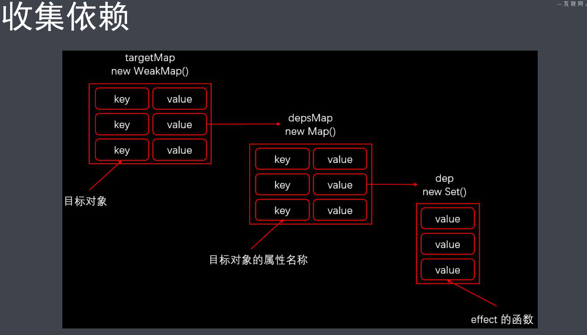

## 简答题

（请直接在本文件中作答）

#### 1、Vue 3.0 性能提升主要是通过哪几方面体现的？
- 源码体积优化
- 响应式系统升级
- 编译优化

#### 2、Vue 3.0 所采用的 Composition Api 与 Vue 2.x使用的Options Api 有什么区别？

- Composition Api 可以根据逻辑功能来组织代码，提高可读性和复用
- Composition Api丰富的api使得定义响应式的变量更方便

　

　

#### 3、Proxy 相对于 Object.defineProperty 有哪些优点？
- Proxy可以监听动态新增的属性
- Proxy可以监听删除的属性
- Proxy可以监听数组的索引和length属性

　


#### 4、Vue 3.0 在编译方面有哪些优化？
- Fragments
- 静态提升
- Patch flag
- 缓存事件处理函数
- 移除了不常用的API
- `Tree-shaking`
　

　

#### 5、Vue.js 3.0 响应式系统的实现原理？
- 使用Proxy设置对象为响应式
```JavaScript
function reactive (target) {
  return new Proxy(target, {
    get (target, key, receiver) {
      // 收集依赖
      track(target, key)
      return Reflect.get(target, key, receiver)
    },
    set (target, key, value, receiver) {
      // 触发更新
      trigger(target, key)
      return Reflect.set(target, key, value, receiver)
    },
    deleteProperty (target, key) {
       // 触发更新
      trigger(target, key)
      return Reflect.deleteProperty(target, key)
    }
  })
}
```
- get方法收集依赖
```JavaScript

// let obj = {
//   price: 12,
// }

// effect(() => {
//   total = product.price * product.count
// })
// 最终得到的targetMap
// {
//   obj: {
//     price: [() => {
//       total = product.price * product.count
//     }]
//   }
// }
let targetMap = new WeakMap()
function track (target, key) {
  targetMap.set(target,
  new Map([[key,
  new Set([activeEffect])
]]))
}
```


- set方法触发更新
```JavaScript
function trigger (target, key) {
  const depsMap = targetMap.get(target, key)
  depsMap.get(key).forEach(effect => {
    effect()
  })
}
```
　

　

　